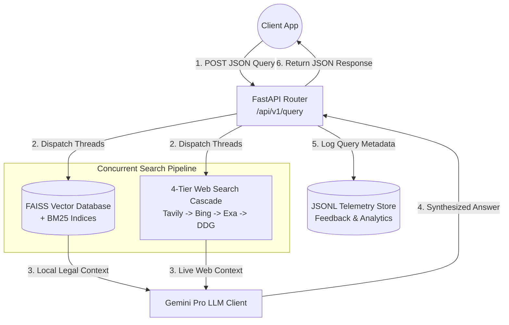
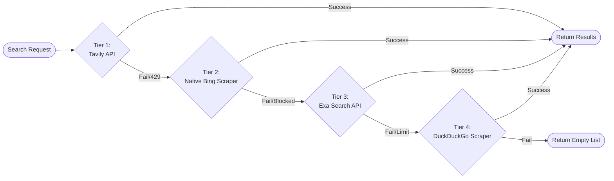
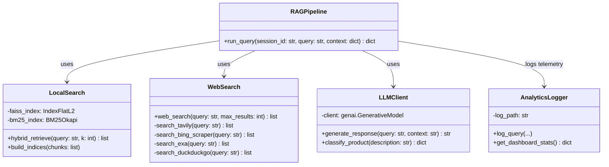
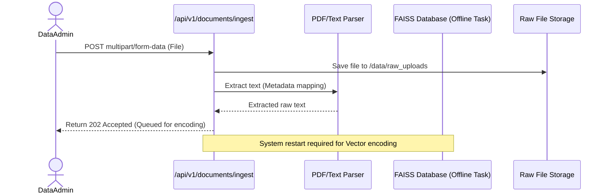

# VaidyaSetu Backend Architecture

This document provides a high-level overview of the VaidyaSetu Backend Architecture. It details the interaction between the FastAPI server, the Machine Learning (ML) Engine, the external Web Search cascade, and the internal FAISS Vector Database.

---

## 1. System Use Case Diagram

The system serves three primary actors: **End Users**, **Data Administrators**, and **System Administrators**.

```mermaid
usecaseDiagram
    actor User as End User
    actor Admin as System Admin
    actor DataAdmin as Data Admin

    package "VaidyaSetu Core" {
        usecase "Query Legal Data" as UC1
        usecase "Submit Feedback" as UC2
        usecase "View Analytics Dashboard" as UC3
        usecase "Classify Product Category" as UC4
        usecase "Check Supersession Status" as UC5
        usecase "Ingest New Documents" as UC6
    }

    User --> UC1
    User --> UC2
    User --> UC4
    User --> UC5

    Admin --> UC3
    DataAdmin --> UC6
```

---

## 2. Component Data Flow Diagram (DFD)

The system employs a concurrent RAG (Retrieval-Augmented Generation) pipeline. When a user query arrives, the system simultaneously searches internal vectors and the live web to minimize latency.



---

## 3. Web Search Cascade Flow Diagram

To ensure indestructible external context retrieval, the web search component relies on a resilient 4-Tier fallback cascade mechanism. If any API is rate-limited (429) or offline, the system instantly degrades gracefully to the next tier.



---

## 4. Class Diagram: ML Engine Core

The backend is modularized. The `ml_engine` package encapsulates all search, retrieval, generation, and telemetry logic, exposing clean interfaces to the FastAPI routers.



---

## 5. Sequence Diagram: Data Ingestion

The ingestion endpoint allows Data Administrators to upload new raw PDFs or Text documents into the system.


